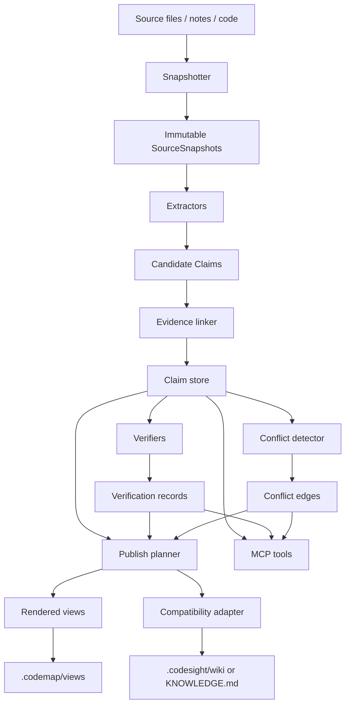

# CodeMap Architecture
Version: 0.1  
Status: implementation handoff  
Audience: Codex / maintainers / reviewers  
Scope: hardened successor to Codesight, designed to prevent fact drift, context drift, and compounding summary errors

## 1) Purpose

CodeMap is a hardened successor to Codesight. It keeps the useful parts of Codesight's current model — fast project scanning, wiki-style outputs, MCP access, watch mode, git-hook automation, and knowledge-mode support — while changing the *canonical substrate* from rendered markdown to verified claims with attached evidence.

The primary design goal is:

> **Rendered views are never the system of record.**
> The system of record is a claim/evidence graph derived from immutable source snapshots.

That rule exists to prevent:
- recursive summarization drift
- context loss through repeated compression
- stale claims persisting behind polished prose
- weak provenance that looks trustworthy but cannot be audited
- blind overwrite behavior in watch mode or commit hooks

## 2) Why CodeMap exists

Codesight today is strong at extraction and lightweight delivery. It already:
- generates `.codesight/wiki/` as a persistent codebase wiki
- supports `--watch` and `--hook` so outputs stay current
- supports `--mode knowledge` to summarize markdown notes into `KNOWLEDGE.md`
- exposes wiki and scan data through MCP tools
- caches MCP scan results per session for speed

Those are good product traits. But they also create hardening pressure:

1. **Rendered markdown is treated too much like durable truth.**  
   Once a summary is published, later sessions and tools can over-trust it.

2. **Knowledge mode is especially exposed to abstraction drift.**  
   Decisions, open questions, and themes are synthesized from notes; if the synthesis drops qualifiers, the output can become more certain than the source.

3. **Automation currently favors overwrite over adjudication.**  
   Watch mode and git hooks are great ergonomically, but a hardened system must verify and publish intentionally, not just regenerate.

CodeMap keeps the ergonomics, but changes the data model and lifecycle so drift is detectable, reversible, and reviewable.

## 3) Product principles

1. **Source-first**
   - Raw source files are immutable inputs.
   - Every publishable claim must point to a source snapshot.
   - No rendered sentence is authoritative without evidence.

2. **Claim-first**
   - Extract atomic claims before rendering prose.
   - Verify claims before publication.
   - Render pages from claims, not the reverse.

3. **No recursive truth**
   - A rendered summary may help navigation, but it must never be reused as the sole evidence source for later claims.
   - Re-ground on raw snapshots whenever a claim is revised or re-published.

4. **Explicit uncertainty**
   - Distinguish `verified`, `inferred`, `stale`, `conflicting`, and `superseded`.
   - Preserve Codesight's existing habit of labeling inferred results.

5. **Hash-based freshness**
   - Freshness is derived from source snapshots and verification records, not from page timestamps alone.

6. **Conflict is first-class**
   - Contradictions are modeled explicitly.
   - The renderer should show disagreement instead of flattening it.

7. **Dual-write migration**
   - Legacy `.codesight/` output remains available during migration.
   - CodeMap writes to `.codemap/` and can optionally emit compatibility markdown for old consumers.

## 4) Non-goals

CodeMap is **not**:
- a general-purpose vector database
- an autonomous truth engine
- a full code intelligence graph for arbitrary semantic search
- a replacement for raw source review
- a system that hides uncertainty for cleaner UX

## 5) Canonical architecture



## 6) Storage model

CodeMap should store canonical data in structured files under `.codemap/` (initially JSON or NDJSON for simplicity).

### Recommended directory layout

```text
.codemap/
  snapshots/
    manifest.json
    files/
      <snapshot-id>.json
  claims/
    claims.ndjson
    claim-index.json
  evidence/
    evidence.ndjson
  verification/
    verification.ndjson
  conflicts/
    conflicts.ndjson
  publish/
    publish-plan.json
    incidents.ndjson
  views/
    index.md
    overview.md
    code/
    knowledge/
  compatibility/
    wiki/
    KNOWLEDGE.md
  cache/
    scan-state.json
```

### Core entities

#### SourceSnapshot
```ts
type SourceSnapshot = {
  id: string;                 // stable hash-based id
  sourcePath: string;         // repo-relative path
  sourceKind: "code" | "note" | "config" | "generated" | "external";
  contentHash: string;        // sha256 of raw content
  gitCommit?: string;         // optional commit SHA
  language?: string;
  createdAt: string;          // ISO timestamp
  sizeBytes: number;
};
```

#### EvidenceSpan
```ts
type EvidenceSpan = {
  id: string;
  snapshotId: string;
  sourcePath: string;
  startLine: number;
  endLine: number;
  excerptHash: string;
  detectorMethod: "ast" | "regex" | "heuristic" | "manual" | "imported";
  confidence: number;         // detector confidence, not publication confidence
  labels: string[];           // e.g. ["inferred", "knowledge", "decision-record"]
};
```

#### Claim
```ts
type ClaimStatus =
  | "candidate"
  | "verified"
  | "inferred"
  | "stale"
  | "conflicting"
  | "superseded"
  | "quarantined";

type Claim = {
  id: string;
  type:
    | "route"
    | "model"
    | "relation"
    | "component"
    | "env_var"
    | "middleware"
    | "dependency_hotspot"
    | "knowledge_decision"
    | "knowledge_question"
    | "knowledge_theme"
    | "knowledge_person"
    | "knowledge_summary";
  subject: string;            // entity or topic
  text: string;               // atomic, single-assertion wording
  sourceSnapshotIds: string[];
  evidenceSpanIds: string[];
  status: ClaimStatus;
  supportScore: number;       // evidence quality
  publicationConfidence: number;
  firstSeenAt: string;
  lastVerifiedAt?: string;
  supersedes?: string[];
  supersededBy?: string[];
  tags: string[];
};
```

#### VerificationRecord
```ts
type VerificationRecord = {
  id: string;
  claimId: string;
  verifier:
    | "line-exists"
    | "hash-match"
    | "ast-shape"
    | "schema-consistency"
    | "conflict-check"
    | "knowledge-support"
    | "manual-review";
  outcome: "pass" | "fail" | "warn";
  reason: string;
  createdAt: string;
  snapshotIdsChecked: string[];
};
```

#### ConflictEdge
```ts
type ConflictEdge = {
  id: string;
  claimA: string;
  claimB: string;
  relation: "conflicts" | "narrows" | "supersedes" | "duplicates";
  severity: "low" | "medium" | "high";
  createdAt: string;
  rationale: string;
};
```

## 7) Lifecycle: snapshot → claim → verify → publish

### Phase A: snapshot
- Read source files and notes.
- Create immutable snapshots keyed by content hash.
- If content hash is unchanged, preserve prior verification records where valid.

### Phase B: extraction
- Run existing Codesight detectors where possible.
- Convert detector outputs into atomic claims.
- Attach evidence spans.
- Preserve detector method (`ast`, `regex`, etc.).
- Preserve inferred labeling on weaker paths.

### Phase C: verification
Every claim must pass a verification set before it becomes publishable.

#### Minimum verification gates
- **source-exists**: source file still exists
- **span-valid**: line span still resolves
- **hash-consistent**: evidence snapshot unchanged or explicitly revalidated
- **shape-consistent**: AST structure still matches for code-derived claims
- **support-present**: knowledge claims still have supporting spans
- **conflict-checked**: no unresolved high-severity contradiction

### Phase D: publication planning
The publish planner decides:
- publish
- republish with warning badge
- quarantine
- deprecate
- supersede

### Phase E: rendering
Render prose and indexes from verified claims only.

**Rule:** rendering is a view-layer concern. The renderer may aggregate, group, and explain, but may not create unsupported facts.

## 8) No-recursive-summarization rule

This is the core hardening rule.

### Allowed
- Using prior rendered pages for navigation
- Using prior rendered pages to find candidate topics or claim IDs
- Using prior rendered pages as a user-facing convenience layer

### Not allowed
- Treating a prior summary paragraph as source evidence
- Revising a claim based only on an older rendered page
- Generating a new “truth” page by summarizing older generated pages without re-grounding on snapshots

### Required behavior
If a renderer or updater touches an existing summary page, it must:
1. resolve the referenced claim IDs
2. confirm the linked evidence remains valid
3. pull from raw snapshots again when the claim is stale, conflicted, or modified

## 9) Code mode hardening

For code-derived claims:
- prefer AST extraction when available
- keep regex / heuristic outputs, but label them as `inferred` or lower-confidence
- use line spans plus AST node identity when possible
- invalidate claims when source hashes change
- use blast-radius and import graph only as supporting context, not as fact authority

### Example
Bad:
> `auth.md` says the app uses JWT sessions, so keep that.

Good:
- claim: “middleware `src/lib/auth.ts` checks JWT bearer token”
- evidence: `src/lib/auth.ts:12-31`
- verification: line exists, AST call shape valid
- rendered summary: “Auth currently relies on JWT bearer validation in `src/lib/auth.ts`.”

## 10) Knowledge mode hardening

Knowledge mode is where context drift risk is highest.

### Model knowledge as claims, not bullets
Do not directly emit:
- Key Decisions
- Open Questions
- Themes
- People

Instead:
1. detect candidate claims from notes
2. attach exact note spans
3. classify each claim as explicit or inferred
4. publish grouped views from those claims

### Knowledge claim types
- `knowledge_decision`
- `knowledge_question`
- `knowledge_theme`
- `knowledge_person`
- `knowledge_summary`

### Extra rules
- A decision must cite a note span showing an explicit decision or strong, reviewable signal.
- Themes are always lower confidence than explicit decisions unless manually promoted.
- Open questions must preserve uncertainty; do not silently collapse them into recommendations.
- If two notes disagree, publish a conflict section instead of flattening to one answer.

### Example
Bad:
> “Team decided to use Polar globally.”

Good:
- claim A: “ADR-002 says team is going with Polar over Stripe Connect.”
- evidence: `decisions/adr-002-payments.md:14-27`
- status: verified

And optionally:
- claim B: “Meeting notes still discuss Stripe marketplace application timing.”
- evidence: `meetings/2026-03-29-sync.md:42-50`
- status: conflicting

Rendered view:
> Payments decision currently favors Polar, but Stripe-related planning remains open in later notes.

## 11) Rendering model

CodeMap should render multiple views from the same claim graph.

### Mandatory views
- `.codemap/views/index.md`
- `.codemap/views/overview.md`
- `.codemap/views/code/*.md`
- `.codemap/views/knowledge/*.md`

### Optional compatibility views
- `.codemap/compatibility/wiki/*`
- `.codemap/compatibility/KNOWLEDGE.md`

### Rendering requirements
Each rendered section must:
- list contributing claim IDs in hidden metadata or footnotes
- show freshness / verification badge
- mark inferred content clearly
- surface conflicts
- avoid unsupported synthesis

### Suggested frontmatter
```yaml
title: Auth
view_type: code_topic
generated_at: 2026-04-21T00:00:00Z
claim_count: 12
verified_claim_count: 10
inferred_claim_count: 2
stale_claim_count: 0
conflict_count: 1
source_snapshot_count: 4
```

## 12) MCP design

Retain the spirit of Codesight's existing MCP ergonomics, but expose claim-aware tools.

### Required new tools
- `codemap_get_overview`
- `codemap_search_claims`
- `codemap_get_claim`
- `codemap_get_claim_evidence`
- `codemap_get_conflicts`
- `codemap_verify_claim`
- `codemap_diff_since_snapshot`
- `codemap_get_publish_status`

### Compatibility tools to preserve or emulate
- wiki index access
- article-by-name access
- lint / health access
- refresh / rescan

### MCP rules
- Cached scan results must be invalidated by content hash or explicit refresh.
- MCP tools should return claim IDs and evidence references, not only rendered prose.
- If a claim is stale or conflicting, the tool must say so directly.

## 13) Watch mode and git hook hardening

### Existing behavior to preserve ergonomically
- fast feedback
- auto-updates
- minimal user effort

### Behavior to change
Watch mode and git hooks must no longer perform blind markdown regeneration.

### New watch pipeline
```text
file change
  -> snapshot changed files
  -> find affected claims
  -> re-run extraction for affected areas
  -> re-verify impacted claims
  -> update publish plan
  -> render draft views
  -> publish only if policy allows
```

### New git hook default
Pre-commit should:
- run snapshot + verify
- fail or warn on high-severity conflicts / stale critical claims
- optionally update compatibility views
- never silently stage misleading output

Recommended modes:
- `--hook mode=warn` for local adoption
- `--hook mode=block` for strict repos
- `--hook mode=shadow` during migration

## 14) Migration strategy from deployed Codesight

### Principle
Do not replace legacy `.codesight/` behavior in one jump.

### Stage 1: shadow mode
- Add `.codemap/`
- Keep `.codesight/` untouched
- Generate claim graph + rendered views in parallel
- Compare coverage, freshness, and conflicts

### Stage 2: dual-write mode
- Publish `.codemap/views/*`
- Also emit compatibility markdown under `.codemap/compatibility/`
- Optionally sync compatibility output into `.codesight/wiki/` for existing consumers

### Stage 3: controlled cutover
- Point AI startup docs, MCP consumers, or CI jobs at CodeMap views
- Keep legacy wiki around for rollback

### Stage 4: deprecate legacy truth assumptions
- Legacy wiki becomes a compatibility renderer only
- Canonical store remains claim/evidence data

## 15) Suggested implementation layout

```text
src/
  codemap/
    model/
      types.ts
      ids.ts
    snapshot/
      snapshotter.ts
      manifest.ts
    extract/
      code/
      knowledge/
      normalize.ts
    verify/
      verify-claim.ts
      verify-code.ts
      verify-knowledge.ts
      detect-conflicts.ts
    store/
      snapshots-store.ts
      claims-store.ts
      evidence-store.ts
      verification-store.ts
      conflict-store.ts
    render/
      views/
      compatibility/
      markdown.ts
    publish/
      planner.ts
      policy.ts
    mcp/
      tools/
    migration/
      dual-write.ts
      legacy-adapter.ts
```

## 16) Release phases

### Phase 1 — architecture and types
Deliverables:
- `docs/codemap-architecture.md`
- core types
- `.codemap/` directory contract
- no behavior changes yet

### Phase 2 — snapshot + claim store
Deliverables:
- immutable snapshots
- claim/evidence storage
- one detector path upgraded end-to-end

### Phase 3 — verification + rendering
Deliverables:
- verifier pipeline
- draft publish planner
- new rendered views under `.codemap/views/`

### Phase 4 — knowledge hardening
Deliverables:
- knowledge claim model
- conflict-aware decisions/questions/themes rendering
- no direct uncited `KNOWLEDGE.md` truth output

### Phase 5 — MCP + compatibility
Deliverables:
- claim-aware MCP tools
- dual-write compatibility adapter
- shadow comparison support

### Phase 6 — hooks, watch, and governance
Deliverables:
- hardened watch mode
- hardened git hook
- incident logging
- migration docs

## 17) Test strategy

### Regression tests
Must include:
- deleted source file invalidates claim
- changed line ranges trigger re-verification
- AST shape change downgrades prior claim
- regex/inferred path stays labeled
- stale knowledge claim is marked stale, not silently republished
- conflicting decisions render as conflict
- compatibility markdown never cites missing claim IDs
- watch mode only republishes affected areas
- MCP refresh updates stale session cache
- git hook blocks or warns according to policy

### Golden tests
Create golden outputs for:
- `.codemap/views/index.md`
- a code topic page
- a knowledge topic page
- compatibility wiki output

### Policy tests
- no rendered sentence without contributing claim IDs
- no verified claim without evidence spans
- no high-severity conflict silently hidden from view

## 18) Acceptance criteria

CodeMap is ready for broader adoption when:
- all rendered facts trace to claim IDs and evidence spans
- stale and conflicting states are visible in CLI, MCP, and views
- watch mode and hooks no longer blindly overwrite trusted summaries
- knowledge mode preserves uncertainty and disagreement
- legacy `.codesight/` users can still operate during migration
- build and test suite remain green

## 19) Design heuristics for Codex

When implementing:
- prefer small, test-backed increments
- preserve existing CLI ergonomics where possible
- add new behavior behind explicit flags or new namespaces first
- never delete legacy output until dual-write has proven stable
- optimize for auditability before elegance

## 20) Short summary

Codesight today is a useful extraction and wiki generator. CodeMap should become a **verified claim system with rendered wiki views**, so the pleasant UX remains but summary drift becomes observable, reviewable, and correctable.
